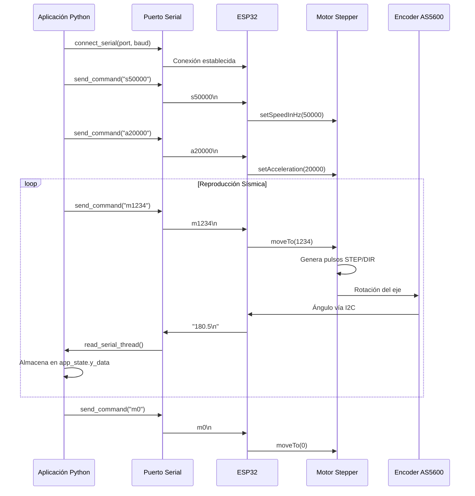
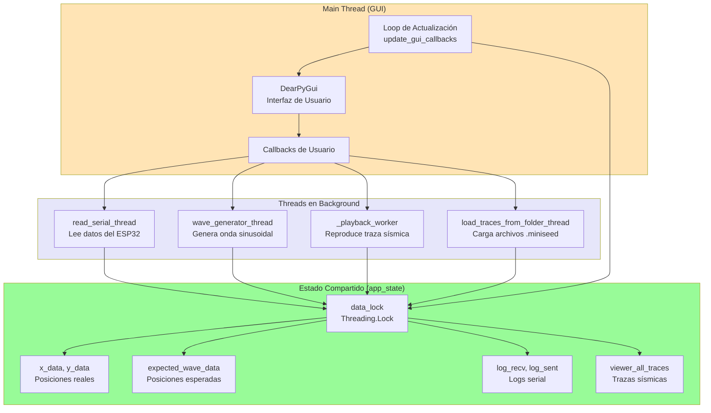
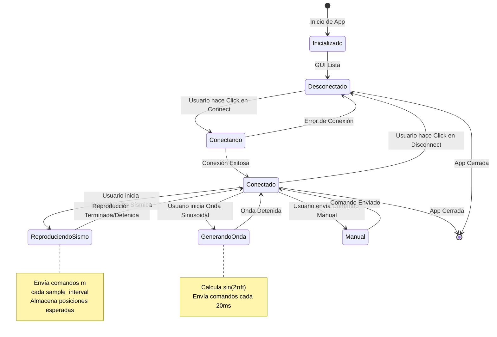
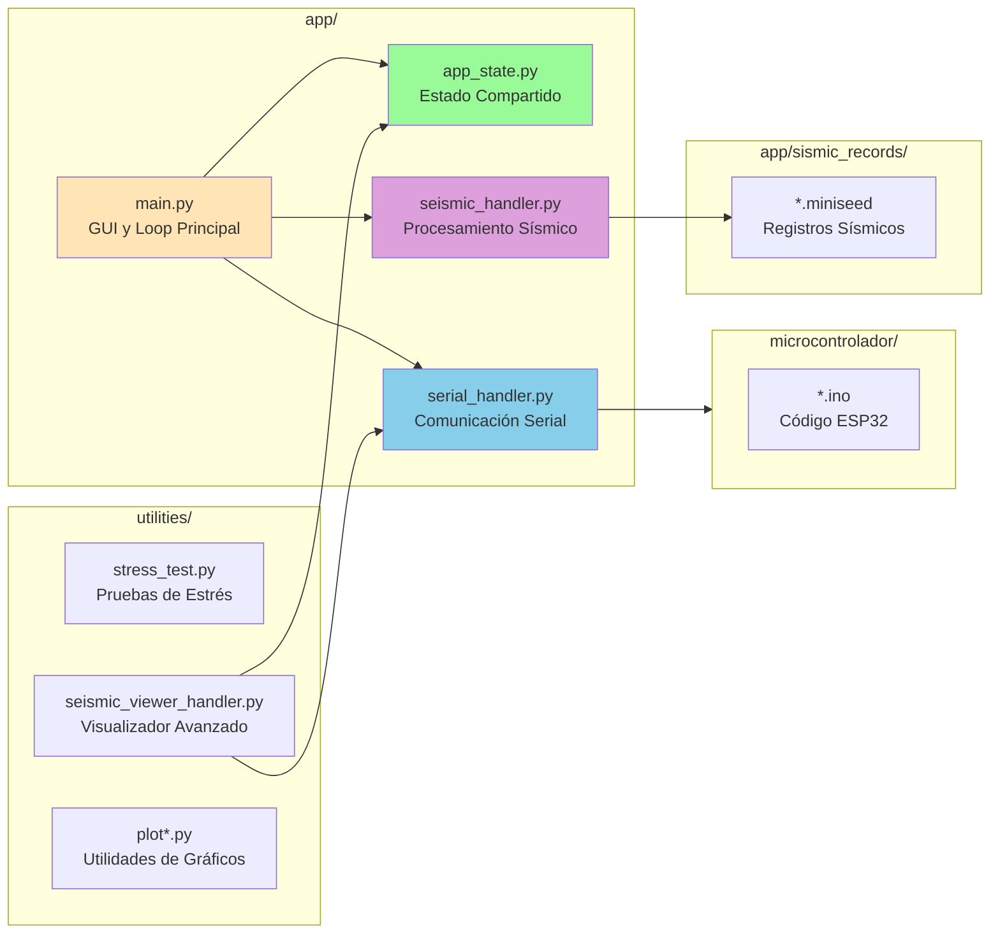

# Diagrama de Flujo del Sistema de Mesa Sísmica

Este documento describe el flujo completo de funcionamiento del sistema de mesa sísmica, desde la carga de datos hasta la ejecución en el hardware.

## Diagrama de Flujo Principal

```mermaid
flowchart TD
    Start([Inicio del Sistema]) --> InitGUI[Inicializar GUI<br/>DearPyGui]
    InitGUI --> InitThreads[Iniciar Threads en Background]
    
    InitThreads --> ReadSerialThread[Thread: Lectura Serial<br/>read_serial_thread]
    InitThreads --> MainLoop[Loop Principal GUI]
    
    MainLoop --> UserAction{Acción del Usuario}
    
    %% Conexión Serial
    UserAction -->|Conectar| ConnectSerial[Conectar a Puerto Serial<br/>ESP32]
    ConnectSerial --> CheckConnection{Conexión<br/>Exitosa?}
    CheckConnection -->|Sí| EnableControls[Habilitar Controles<br/>Motor y Comandos]
    CheckConnection -->|No| ShowError[Mostrar Error]
    EnableControls --> MainLoop
    ShowError --> MainLoop
    
    %% Carga de Datos Sísmicos
    UserAction -->|Cargar Datos| LoadSeismic[Thread: Cargar Archivos<br/>.miniseed desde<br/>sismic_records/]
    LoadSeismic --> ParseFiles[Parsear Archivos con<br/>ObsPy]
    ParseFiles --> ExtractTraces[Extraer Trazas Sísmicas<br/>ID, Station, Channel, etc.]
    ExtractTraces --> StoreTraces[Almacenar en<br/>app_state.viewer_all_traces]
    StoreTraces --> UpdateViewer[Actualizar Árbol de<br/>Archivos en GUI]
    UpdateViewer --> MainLoop
    
    %% Selección y Procesamiento de Traza
    UserAction -->|Seleccionar Traza| SelectTrace[Seleccionar Traza<br/>del Árbol]
    SelectTrace --> ShowDetails[Mostrar Detalles<br/>de la Traza]
    ShowDetails --> ProcessOption{Procesar para<br/>Mesa?}
    
    ProcessOption -->|Sí| ProcessTrace[Procesar Traza Sísmica]
    ProcessTrace --> Detrend[1. Detrend Lineal<br/>Remover tendencia]
    Detrend --> Filter[2. Filtro Bandpass<br/>0.1-20 Hz]
    Filter --> Differentiate[3. Diferenciar<br/>Velocidad → Aceleración]
    Differentiate --> StoreAccel[Almacenar Aceleración<br/>en app_state]
    StoreAccel --> MainLoop
    
    %% Reproducción de Traza Sísmica
    ProcessOption -->|Reproducir| PlaySeismic[Iniciar Reproducción<br/>Sísmica]
    PlaySeismic --> CheckConnected2{Conectado<br/>a ESP32?}
    CheckConnected2 -->|No| ErrorNotConnected[Error: No Conectado]
    ErrorNotConnected --> MainLoop
    CheckConnected2 -->|Sí| PreparePlayback[Preparar Traza para<br/>Reproducción]
    
    PreparePlayback --> Detrend2[Detrend + Taper]
    Detrend2 --> Integrate1[Integración 1<br/>Aceleración → Velocidad]
    Integrate1 --> Integrate2[Integración 2<br/>Velocidad → Desplazamiento]
    Integrate2 --> Normalize[Normalizar y Escalar<br/>a Pasos del Motor]
    Normalize --> SendConfig[Enviar Configuración<br/>s<velocidad><br/>a<aceleración>]
    
    SendConfig --> PlaybackLoop[Loop de Reproducción]
    PlaybackLoop --> GetSample[Obtener Siguiente<br/>Muestra de Desplazamiento]
    GetSample --> SendCommand[Enviar Comando<br/>m<posición>]
    SendCommand --> StoreExpected[Almacenar Posición<br/>Esperada]
    StoreExpected --> WaitInterval[Esperar Intervalo<br/>de Muestreo]
    WaitInterval --> CheckRunning{Reproducción<br/>Activa?}
    CheckRunning -->|Sí| GetSample
    CheckRunning -->|No| StopMotor[Enviar m0<br/>Detener Motor]
    StopMotor --> MainLoop
    
    %% Generador de Onda Sinusoidal
    UserAction -->|Onda Sinusoidal| StartSine[Iniciar Generador<br/>de Onda Sinusoidal]
    StartSine --> GetParams[Obtener Parámetros<br/>Amplitud y Frecuencia]
    GetParams --> SendConfig2[Enviar Configuración<br/>s<velocidad><br/>a<aceleración>]
    SendConfig2 --> SineLoop[Loop Generación Sinusoidal]
    SineLoop --> CalcPosition[Calcular Posición<br/>A*sin(2πft)]
    CalcPosition --> SendCommand2[Enviar Comando<br/>m<posición>]
    SendCommand2 --> Wait20ms[Esperar 20ms]
    Wait20ms --> CheckWaveRunning{Onda<br/>Activa?}
    CheckWaveRunning -->|Sí| CalcPosition
    CheckWaveRunning -->|No| StopMotor2[Enviar m0]
    StopMotor2 --> MainLoop
    
    %% Comando Manual
    UserAction -->|Comando Manual| ManualCommand[Enviar Comando Manual<br/>m, s, a, etc.]
    ManualCommand --> SendCommand3[Enviar a Serial]
    SendCommand3 --> LogSent[Registrar en Log<br/>Enviados]
    LogSent --> MainLoop
    
    %% Thread de Lectura Serial
    ReadSerialThread --> CheckSerial{Serial<br/>Disponible?}
    CheckSerial -->|No| SleepSerial[Esperar 0.5s]
    SleepSerial --> CheckSerial
    CheckSerial -->|Sí| ReadLine[Leer Línea Serial]
    ReadLine --> ParseAngle[Parsear Ángulo<br/>del Encoder]
    ParseAngle --> CalcAbsolute[Calcular Ángulo<br/>Absoluto con Vueltas]
    CalcAbsolute --> StoreReal[Almacenar Posición Real<br/>en app_state.y_data]
    StoreReal --> LogRecv[Registrar en Log<br/>Recibidos]
    LogRecv --> CheckSerial
    
    %% Actualización GUI
    MainLoop --> UpdateGUI[Actualizar GUI]
    UpdateGUI --> UpdatePlots[Actualizar Gráficos<br/>Posición Real vs Esperada]
    UpdatePlots --> UpdateLogs[Actualizar Logs<br/>Serial]
    UpdateLogs --> RenderFrame[Renderizar Frame<br/>DearPyGui]
    RenderFrame --> CheckRunning2{App<br/>Ejecutándose?}
    CheckRunning2 -->|Sí| MainLoop
    CheckRunning2 -->|No| Cleanup[Limpiar Recursos<br/>Desconectar Serial]
    Cleanup --> End([Fin])
    
    style Start fill:#90EE90
    style End fill:#FFB6C1
    style ProcessTrace fill:#87CEEB
    style PlaybackLoop fill:#FFD700
    style SineLoop fill:#FFD700
    style ReadSerialThread fill:#DDA0DD
    style MainLoop fill:#F0E68C
```

## Flujo de Datos: Procesamiento Sísmico

```mermaid
flowchart LR
    A[Archivo .miniseed] --> B[ObsPy.read]
    B --> C[Trazas Sísmicas<br/>Velocidad/Desplazamiento]
    C --> D[Detrend Lineal]
    D --> E[Filtro Bandpass<br/>0.1-20 Hz]
    E --> F[Diferenciación]
    F --> G[Aceleración]
    
    G --> H[Para Visualización]
    G --> I[Para Reproducción]
    
    I --> J[Detrend + Taper]
    J --> K[Integración 1]
    K --> L[Velocidad]
    L --> M[Integración 2]
    M --> N[Desplazamiento]
    N --> O[Normalización]
    O --> P[Escalado a Pasos]
    P --> Q[Comandos m<pos>]
    
    style A fill:#E6E6FA
    style G fill:#FFE4B5
    style Q fill:#98FB98
```



## Flujo de Comunicación: PC ↔ ESP32



## Arquitectura de Threads



## Flujo de Estados del Sistema



## Comandos Serial (Protocolo ESP32)

```mermaid
flowchart TD
    Command[Comando Serial] --> Parse[Parsear Comando]
    
    Parse --> Type{Tipo de Comando}
    
    Type -->|m<num>| MoveTo[stepper->moveTo(num)<br/>Mover a posición]
    Type -->|s<num>| SetSpeed[stepper->setSpeedInHz(num)<br/>Configurar velocidad]
    Type -->|a<num>| SetAccel[stepper->setAcceleration(num)<br/>Configurar aceleración]
    Type -->|e<0/1>| Enable[stepper->enable/disable<br/>Habilitar/Deshabilitar]
    
    MoveTo --> Motor[Motor Stepper]
    SetSpeed --> Motor
    SetAccel --> Motor
    Enable --> Motor
    
    Motor --> Encoder[Encoder AS5600<br/>Lee posición]
    Encoder --> SerialOut[Serial.println(angle)<br/>Enviar ángulo a PC]
    
    style Command fill:#FFE4B5
    style Motor fill:#98FB98
    style Encoder fill:#DDA0DD
```

## Estructura de Archivos y Responsabilidades



## Resumen del Flujo Completo

1. **Inicialización**: La aplicación inicia la GUI y crea threads en background para lectura serial.

2. **Conexión**: El usuario selecciona un puerto serial y se conecta al ESP32.

3. **Carga de Datos**: El usuario carga archivos sísmicos (.miniseed) que se parsean con ObsPy.

4. **Selección y Procesamiento**: El usuario selecciona una traza y la procesa (filtrado, diferenciación/integración).

5. **Reproducción**: El sistema convierte la traza procesada en comandos de posición y los envía al ESP32.

6. **Control del Motor**: El ESP32 recibe comandos y controla el motor stepper mediante pulsos STEP/DIR.

7. **Feedback**: El encoder AS5600 lee la posición real y la envía de vuelta a la PC.

8. **Visualización**: La GUI muestra en tiempo real la posición esperada vs la posición real.

9. **Monitoreo**: Los logs de comunicación serial se muestran en consolas separadas.

---

**Notas Importantes:**
- Todos los accesos a `app_state` están protegidos con `data_lock` para thread-safety.
- El sistema soporta dos modos: reproducción sísmica y generación de ondas sinusoidales.
- El procesamiento sísmico incluye filtrado, integración doble (aceleración → desplazamiento) y normalización.
- El ESP32 ejecuta un loop que lee comandos serial y un task separado que lee el encoder continuamente.

