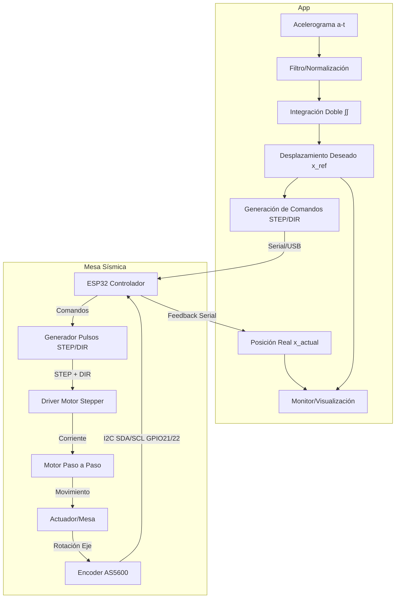
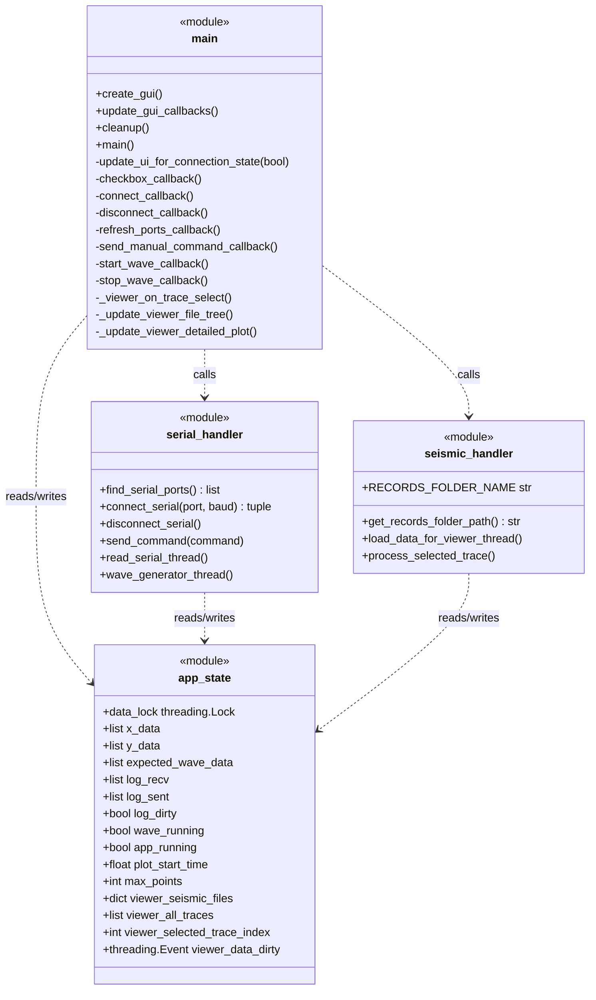
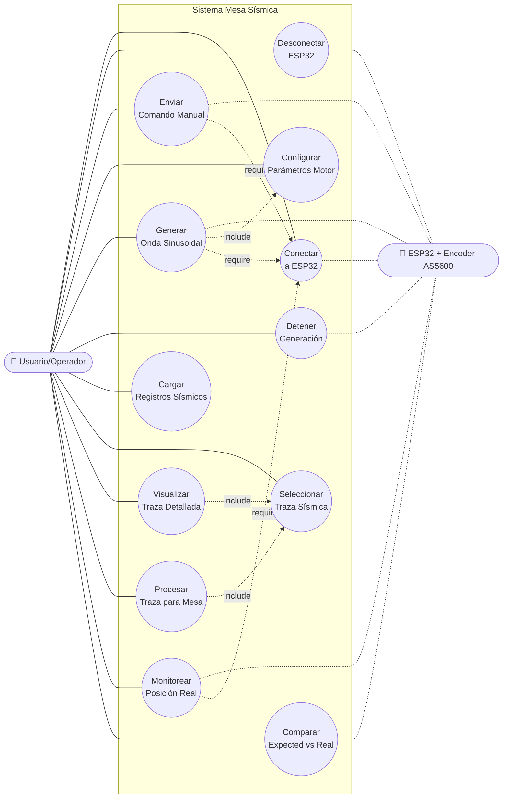

# Mesa Sísmica de Bajo Costo con Control y GUI

Sistema de **reproducción de acelerogramas reales** en una mesa sísmica de laboratorio. Convierte registros aceleración–tiempo en trayectorias de **posición** y las ejecuta en tiempo real mediante un **ESP32** y **realimentación** con encoder magnético **AS5600**.

## 🧱 Diagrama flujo

## 🧱 Diagrama de Clases 

## 🧱 Diagrama de casos de uso 

[## 🗺️ Roadmap * Migración a **servomotor** + **PID avanzado** (o control en espacio de estados). ]: # 
[## * Mejoras de **filtrado** para reducir deriva post integración. ]: # 
[## * **Auto–calibración** de encoder / homing robusto.]: # 
[## * Soporte para **múltiples ejes** y perfiles 6-DoF (futuro).]: # 
[## * Exportación de **reportes** (PDF/CSV) con métricas de seguimiento.]: # 

[## 📚 Citar / Referencias]: # 

[## 🤝 Contribuciones ]: # 

¡PRs bienvenidos! Abre un **issue** con: descripción, logs, versión de firmware/GUI, esquema de conexiones y archivos de prueba mínimos.

  
